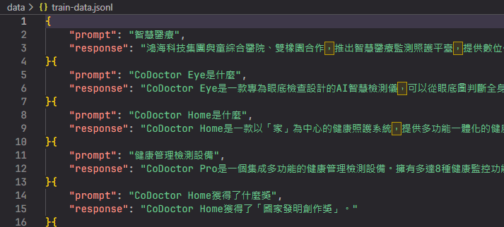
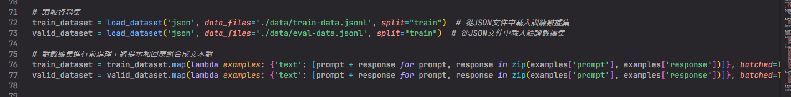
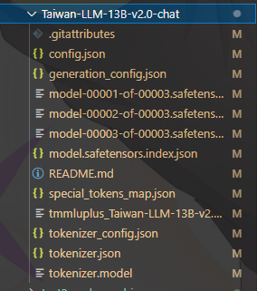
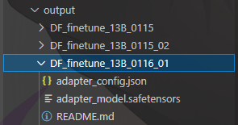

```

                 _oo0oo_
                o8888888o
                88" . "88
                (| -_- |)
                0\  =  /0
              ___/`---'\___
            .' \\|     | '.
            / \\|||  :  ||| \
          / _||||| -:- |||||- \
          |   | \\\  -  / |   |
          | \_|  ''\---/''  |_/ |
          \  .-\__  '-'  ___/-. /
        ___'. .'  /--.--\  `. .'___
    ."" '<  `.___\_<|>_/___.' >' "".
    | | :  `- \`.;`\ _ /`;.`/ - ` : | |
    \  \ `_.   \_ __\ /__ _/   .-` /  /
=====`-.____`.___ \_____/___.-`___.-'=====
                  `=---='


~~~~~~~~~~~~~~~~~~~~~~~~~~~~~~~~~~~~~~~~~~~

          佛祖保佑         永無BUG


```

# [为什么fine-tune过程中loss会忽大忽小呢](https://github.com/Facico/Chinese-Vicuna/issues/39)


# 文件夾 - folder tree 
```
finetune_llama  
    -model (放llama model的位置)  
    -output (finetune後輸出的文件)
    -script (放llama_langChain_embedding.py)  
        -data (放資料 .json)  
    Dockerfile  
    requirement.txt  
```

# 訓練資料 會有train 跟 eval兩個檔
### **train_dataset 是訓練資料 ， eval_dataset是評估資料(loss的評估)**

## 格式沒有統一的版本 格式化的json比較好 


### [TW-llama的FineTune datasets](https://huggingface.co/datasets/yentinglin/TaiwanChat)  
### [其中一個FineTune datasets的展示](https://github.com/f901107/Fine_tuning_LLMs)

## Finetune的時候 要數據集進行前處理 要把資料拉出來 



# 整個llama2 fine tune (可以參考下面的Google_Colab)
### [Fine_tune_Llama_2_in_Google_Colab.ipynb](https://colab.research.google.com/github/f901107/Fine_tuning_LLMs/blob/main/Fine_tune_Llama_2_in_Google_Colab.ipynb#scrollTo=OJXpOgBFuSrc)

### [我的FineTune的程式碼 llama_finetune.py](llama_finetune.py)  
### **Finetune後，他會生一個lora weights，用下面的程式碼合併lora weights跟本來的model去融合進化生一個新的model**

# llama的檔案 (合併後也會一樣像本來的llama)


# lora weights的檔案 


# 合併lora weights，儲存完整模型
### [[NLP] LLM---＜训练中文LLama2(四)方式二＞对LLama2进行SFT微调](https://blog.csdn.net/zwqjoy/article/details/132765488)


